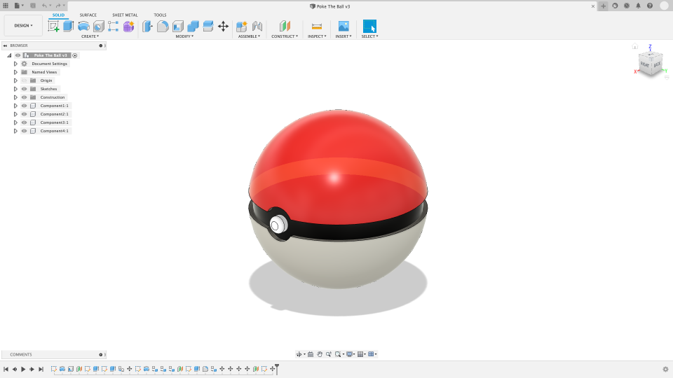
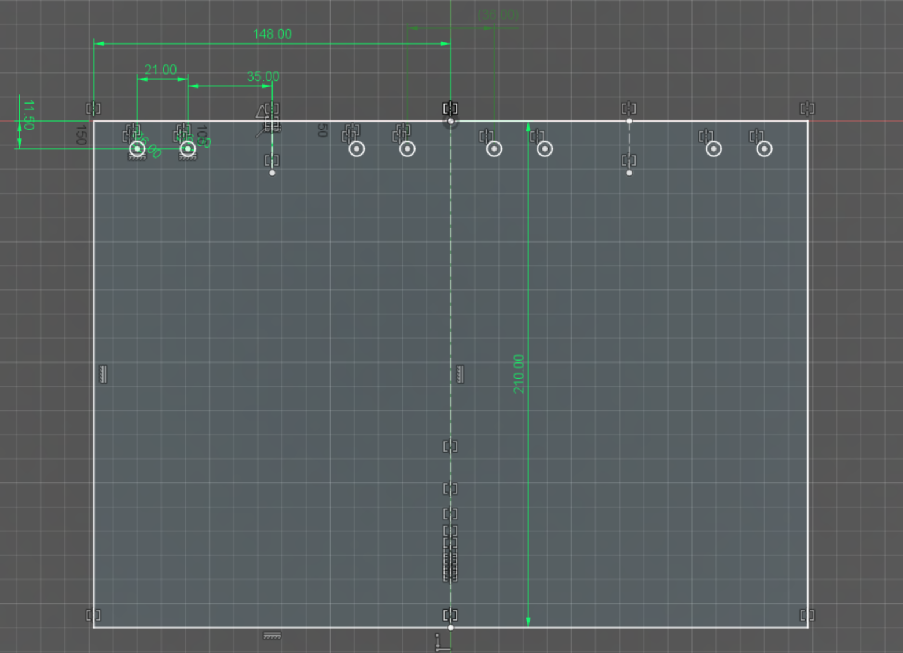

# Макет звіту про виконання роботи

> Скопіюйте цей файл до папки своєї роботи. Замініть текст у квадратних дужках власними даними, а приклади зображень — власними скріншотами. Перед поданням видаліть цю підказку та розділ із прикладами.

## Відомості про роботу

- **Назва роботи:** [назва]
- **Автор звіту:** [прізвище та ім’я]
- **Дата виконання:** [дата]

## Мета роботи

[Коротко сформулюйте мету роботи одним або двома реченнями.]

## Хід виконання

### Етап 1. [Назва етапу]

[Коротко опишіть виконану дію, використану команду та отриманий результат.]

*Рисунок 1. Приклад підпису: відкрито документ і показано поточний результат у робочій області Fusion.*

### Етап 2. [Назва етапу]

[Коротко опишіть наступну дію та отриманий результат. За потреби додайте інші етапи за таким самим зразком.]

## Повний результат роботи

*Рисунок 2. Приклад підпису: повний результат роботи з видимою геометрією, розмірами й обмеженнями.*

## Відповідність вимогам

Заповніть таблицю та вкажіть номер рисунка, на якому видно підтвердження.

| Вимога | Виконано | Доказ |
| --- | --- | --- |
| [Перша вимога завдання] | Так / Ні | Рисунок № |
| [Друга вимога завдання] | Так / Ні | Рисунок № |
| [Третя вимога завдання] | Так / Ні | Рисунок № |

## Обґрунтування творчого бала

[Заповнюйте цей розділ, якщо претендуєте на 12-й бал. Назвіть використану можливість, поясніть, чому її не розглядали на відповідних уроках, опишіть її користь і вкажіть номер рисунка. Якщо не претендуєте на творчий бал, напишіть «Не застосовувалося».]

## Приклади оформлення скріншотів

Зображення в цьому макеті демонструють оформлення, нумерацію та підписи. Вони не показують виконання конкретного завдання і мають бути замінені власними скріншотами.

### Джерела прикладів

1. Aylah-a63, [Fusion 360 Screenshot.png](https://commons.wikimedia.org/wiki/File:Fusion_360_Screenshot.png), Wikimedia Commons, [CC BY-SA 4.0](https://creativecommons.org/licenses/by-sa/4.0/). Зображення не змінено.
2. erikcederb, 3DVerkstan, [2020-03-20 16 51 24-Autodesk Fusion 360.png](https://commons.wikimedia.org/wiki/File:2020-03-20_16_51_24-Autodesk_Fusion_360.png), Wikimedia Commons, [CC BY-SA 3.0](https://creativecommons.org/licenses/by-sa/3.0/). Зображення не змінено.
