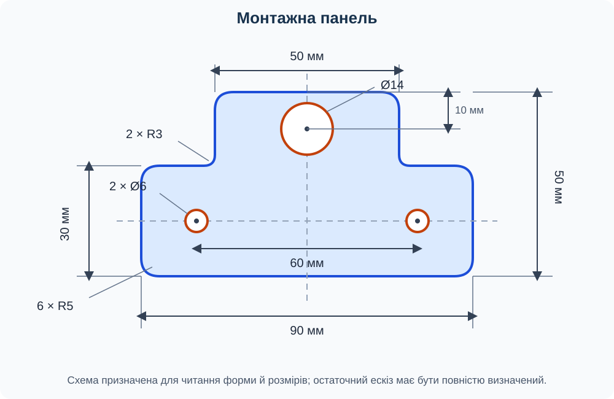

# Самостійна робота 1. Ескіз монтажної панелі

## Тема

Побудова складного замкнутого контуру, використання допоміжної геометрії, обрізання, скруглень, розмірів і геометричних обмежень в Autodesk Fusion.

## Орієнтовний час виконання

20–30 хвилин.

## Мета роботи

Перевірити вміння:

- створювати ескіз на вибраній площині;
- будувати складний контур із прямокутників і кіл;
- використовувати допоміжні осі та симетрію;
- обрізати зайві частини геометрії;
- виконувати скруглення кутів;
- задавати точні розміри та геометричні обмеження;
- повністю визначати ескіз.

## Завдання

Самостійно створіть ескіз симетричної монтажної панелі з верхнім виступом і трьома отворами.

*Рисунок 1. Розмірна схема деталі. Позначення R задає радіус скруглення, Ø — діаметр отвору.*

## Розміри та геометрія

### Зовнішній контур

- загальна ширина — **90 мм**;
- загальна висота — **50 мм**;
- висота нижньої прямокутної частини — **30 мм**;
- ширина верхнього виступу — **50 мм**;
- верхній виступ розташований симетрично відносно вертикальної осі деталі;
- шість зовнішніх опуклих кутів мають скруглення **R5 мм**;
- два внутрішні кути біля основи виступу мають скруглення **R3 мм**.

### Отвори

- два нижні монтажні отвори мають діаметр **6 мм**;
- центри монтажних отворів лежать на горизонтальній осі нижньої частини;
- відстань між центрами монтажних отворів — **60 мм**;
- центральний отвір у верхньому виступі має діаметр **14 мм**;
- центр отвору Ø14 мм лежить на вертикальній осі симетрії та розташований на **10 мм** нижче верхнього краю деталі.

Початок координат розташуйте в центрі нижньої прямокутної частини. Горизонтальна й вертикальна допоміжні осі мають проходити через початок координат.

## Порядок виконання

1. Створіть новий документ і ескіз на одній з основних площин.
2. Побудуйте через початок координат горизонтальну та вертикальну допоміжні осі.
3. Створіть нижню прямокутну частину розміром 90 × 30 мм так, щоб її центр збігався з початком координат.
4. Побудуйте верхній виступ завширшки 50 мм і заввишки 20 мм. Вирівняйте його симетрично відносно вертикальної осі.
5. Застосуйте **Trim (Обрізати)** до спільної ділянки між прямокутниками. Має утворитися один замкнутий зовнішній контур.
6. Виконайте шість зовнішніх скруглень R5 мм і два внутрішні скруглення R3 мм.
7. Побудуйте один монтажний отвір Ø6 мм. Створіть другий отвір дзеркальним відображенням відносно вертикальної осі або задайте обом отворам обмеження симетрії та рівності.
8. Задайте відстань 60 мм між центрами монтажних отворів. Сумістіть їхні центри з горизонтальною віссю.
9. Побудуйте отвір Ø14 мм у верхньому виступі. Сумістіть його центр із вертикальною віссю та задайте відстань 10 мм від центра до верхнього краю.
10. Нанесіть усі розміри, необхідні для однозначного визначення ескізу. Не дублюйте розміри, що вже визначені обмеженнями.
11. Спробуйте перетягнути елементи. Усуньте відсутні розміри або зв’язки, якщо геометрія рухається.
12. Завершіть ескіз і збережіть документ під назвою `Самостійна_робота_01`.

## Що подати на перевірку

- збережений файл моделі або посилання на документ у Fusion;
- звіт про виконання роботи зі скріншотами основних етапів.

## Вимоги до звіту

1. Додайте до звіту скріншоти основних етапів виконання роботи: побудови початкового контуру, створення скруглень і отворів, нанесення розмірів та обмежень.
2. Під кожним скріншотом розмістіть змістовний підпис із поясненням, що саме на ньому зображено та який етап виконано.
3. Останнім у звіті розмістіть скріншот повного результату роботи. На ньому мають бути повністю видимі зовнішній контур, усі отвори, розміри та геометричні обмеження завершеного ескізу.
4. Розташуйте скріншоти в послідовності виконання роботи. Зображення мають бути чіткими, а важливі елементи інтерфейсу та ескізу — читабельними.
5. Якщо претендуєте на 12-й бал, додайте окреме текстове обґрунтування творчого підходу. Назвіть використану можливість Fusion, поясніть, чому вона виходить за межі матеріалів уроків 4–5, та опишіть, як її застосування покращило спосіб або якість виконання роботи. Без такого текстового обґрунтування творчий бал не нараховується.

## Критерії оцінювання

| Складник роботи | Бали |
| --- | ---: |
| Побудовано правильний симетричний зовнішній контур із виступом; зайві лінії обрізано | 2 |
| Загальні розміри, розміри нижньої частини та виступу відповідають завданню | 1 |
| Виконано шість скруглень R5 мм і два скруглення R3 мм | 2 |
| Побудовано три отвори правильних діаметрів | 1 |
| Отвори правильно розташовано відносно осей, країв та один одного | 2 |
| Застосовано доцільні допоміжні осі й геометричні обмеження; ескіз повністю визначений | 2 |
| Документ правильно названо й збережено; звіт містить підписані скріншоти етапів і повний фінальний результат | 1 |
| Творчо й доречно використано можливість Fusion, якої не розглядали на уроках 4–5; її застосування пояснено у звіті та показано на скріншоті | 1 |
| **Разом** | **12** |

Якщо ескіз не є повністю визначеним, але геометрія, розміри й положення елементів правильні, за складник із повним визначенням може бути нараховано **1 бал із 2**.

За виконання всіх обов’язкових вимог можна отримати **11 балів**. **12-й бал** нараховується за самостійний творчий підхід: виконавець має доречно застосувати можливість Fusion, якої не було розглянуто в матеріалах уроків 4–5, зберегти задану форму й розміри деталі, а також пояснити це рішення у звіті. Просте використання додаткової команди без впливу на спосіб або якість виконання не є підставою для нарахування 12-го бала.

## Правила самостійного виконання

Виконуйте роботу індивідуально. Дозволено користуватися матеріалами [уроку 4](../../Уроки/less-04/README.md) та [уроку 5](../../Уроки/less-05/README.md). Готові файли інших учнів використовувати не можна.
