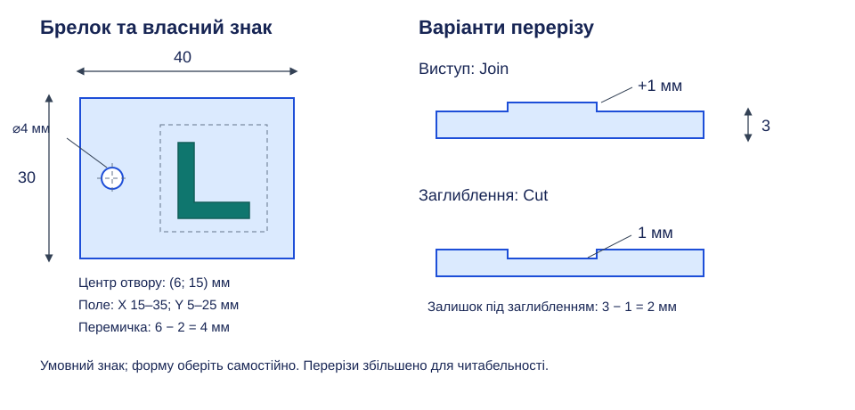
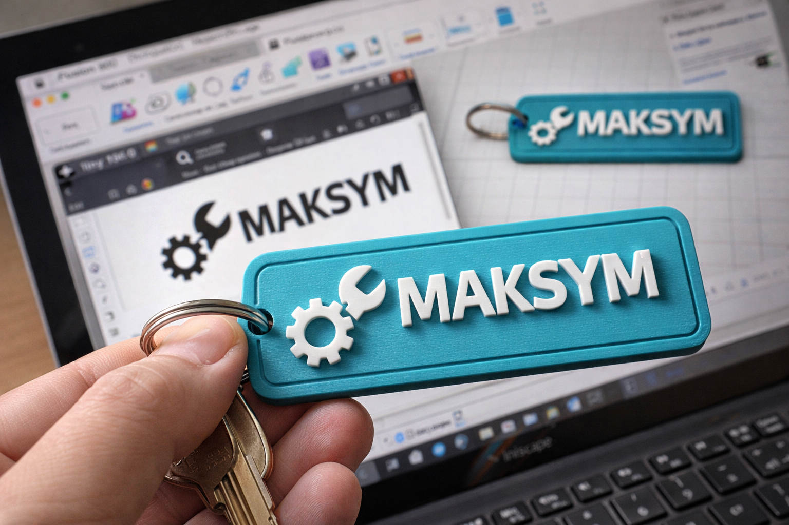

# Практична робота 1. Брелок із власним векторним логотипом

## Тема

Повний шлях від власного знака в Inkscape до брелка в Autodesk Fusion: [урок 6](../../Уроки/less-06/README.md) — векторна геометрія, [урок 7](../../Уроки/less-07/README.md) — основа, рельєф і кріпильний отвір.

## Орієнтовний загальний час виконання

До 80 хвилин практичної роботи в межах двох уроків після коротких пояснень учителя; програми й навчальний обліковий запис мають бути підготовлені заздалегідь. Один звіт ведіть протягом обох занять.

## Мета роботи та вміння

Створити простий брелок, послідовно використовуючи векторні фігури, замкнуті контури, SVG, ескіз із розмірами та операції Extrude. Перевіряються власне компонування знака, масштаб імпорту, вибір New Body, Join і Cut та контроль цілісності моделі.

## Завдання

Розробіть власний знак і створіть брелок із його виступом або заглибленням та наскрізним отвором для кільця. Обов’язковий результат — одна цілісна модель; кільце й текст не потрібні. Фаски та скруглення не обов’язкові, оскільки їх вивчатимете на наступному уроці.

*Рисунок 1. Навчальний приклад брелка 40 × 30 × 3 мм: отвір ⌀4 мм, поле знака 20 × 20 мм, виступ або заглиблення 1 мм; розміри в міліметрах.*

## Вихідні дані, розміри та технічні вимоги

| Елемент | Обов’язкова вимога |
| --- | --- |
| Знак | Власний читабельний логотип, щонайменше один замкнутий контур |
| Деталі знака | Не менше 0,5 мм; ширина штрихів не менше 0,8 мм у кінцевому масштабі |
| SVG | Геометричні контури без вкладеного растрового зображення |
| Основа | Проста форма, товщина 2–3 мм |
| Рельєф | Виступ або заглиблення 0,8–2 мм |
| Кріплення | Наскрізний отвір ⌀4–6 мм, перемичка до зовнішнього краю не менше 3 мм |
| Цілісність | Одне тіло; знак у межах основи, не перетинає отвір; заглиблення не наскрізне |

Для покрокового варіанта використайте основу 40 × 30 мм із нижньою лівою вершиною в початку координат, товщину 3 мм і отвір ⌀4 мм із центром (6; 15). Поле логотипу: X від 15 до 35 мм, Y від 5 до 25 мм. Знак має вміститися в це поле; його габарити можуть бути меншими. Відступ до краю отвору становить 6 − 2 = 4 мм. Для заглиблення 1 мм залишається дно 3 − 1 = 2 мм. Інші габарити допустимі за дотримання всіх вимог; мінімальні величини є навчальними умовами, а не гарантією якості FDM-друку.

## Послідовність виконання

### Урок 6. Логотип та підготовка SVG

1. У Inkscape створіть документ із міліметрами. Оберіть просту ідею знака: наприклад, власну комбінацію двох-трьох прямокутників і кіл. Інструментом вибору переміщуйте й масштабуйте фігури; знак повинен залишатися зрозумілим у полі 20 × 20 мм.
2. Використайте заливку без декоративного обведення. Залиште проміжки між відокремленими елементами; для першого варіанта уникайте взаємного накладання контурів. За потреби перетворіть фігури чи текст через Object to Path, а потрібну ширину обведення — через Stroke to Path. Перевірте вузли: видимий штрих і замкнута область не тотожні.
3. Збережіть файл «Логотип.svg». У Fusion створіть документ «Брелок — логотип» та пробний ескіз на XY з назвою «Проба SVG». Виконайте Insert SVG, виберіть файл, задайте положення й масштаб. Перевірте фактичні габарити та розпізнавання областей для майбутнього витягування.
4. Якщо область не вибирається, знайдіть розрив або зайву геометрію у вихідному SVG; виправте файл і повторіть імпорт без накладання дублікатів. Завершіть пробний ескіз, приховайте його й збережіть документ. Додайте до звіту скріншоти знака та імпорту з габаритами; об’єм поки не створюйте.

### Урок 7. Об’ємна модель брелка

5. Відкрийте збережений документ. Створіть новий ескіз «Основа» на XY: прямокутник 40 × 30 мм із вершиною в початку координат. Задайте розміри й перевірте визначеність. Завершіть ескіз, виконайте Extrude на 3 мм з New Body; назвіть тіло «Брелок».
6. На верхній грані створіть ескіз «Логотип». Повторно вставте перевірений SVG, розмістіть його праворуч у заданому полі та звірте розміри. Завершіть ескіз і виберіть усі потрібні області знака. Для виступу виконайте Extrude на 1 мм від основи з Join; для заглиблення — на 1 мм усередину з Cut. Підтверджуйте лише після огляду результату.
7. На верхній грані створіть ескіз «Кріплення». Побудуйте коло ⌀4 мм із центром за 6 мм від лівого та 15 мм від нижнього краю. Задайте ці розміри відносно прямих країв основи й перевірте, що коло не зачіпає знак. Виконайте Extrude з Cut на 3 мм у напрямку основи; огляньте нижню грань і підтвердьте наскрізність.
8. Перевірте одне тіло в браузері, товщину основи, рельєф, діаметр отвору та перемичку. Якщо знак став окремим тілом, відредагуйте його операцію на Join; якщо заглиблення пройшло наскрізь, зменште глибину. Збережіть модель і завершіть звіт.
9. Додайте докази ескізу основи, параметрів витягування й рельєфу, ескізу отвору з розмірами та наскрізного вирізання. Для заглиблення покажіть залишкову товщину бічним видом або розрізом. Останнім скріншотом покажіть весь брелок під кутом, щоб було видно знак і отвір.

*Рисунок 2. Наявна ілюстрація рельєфного знака; складний логотип, напис, металеве кільце й колір не є обов’язковими елементами роботи.*

## Матеріали для перевірки

Подайте один звіт Markdown або PDF за обидва уроки. Робочі документи збережіть для продовження роботи; файл моделі або посилання на нього подавати не потрібно. Слайсинг, експорт для принтера й друк відкладено до блоку 3D-друку та зараз не оцінюють.

## Вимоги до звіту

На початку зазначте номер роботи, обраний варіант і фактичні розміри. Додайте пронумеровані скріншоти основних етапів у послідовності виконання; під кожним напишіть короткий змістовний підпис про виконану дію та її результат. Геометрія, розміри, параметри операцій і потрібні обмеження мають чітко читатися.

Останній скріншот має показувати повний результат роботи в зручному масштабі без вікон, що перекривають модель. Для кожного обов’язкового пункту заповніть коротку таблицю:

| Вимога | Виконано | Доказ |
| --- | --- | --- |
| Назва конкретної вимоги | Так / частково / ні | № відповідного скріншота |

Для творчого 12-го бала додайте окремий текст: назвіть використану можливість, поясніть, чому її не розглядали у відповідних уроках, і опишіть, як вона покращила спосіб або якість виконання; наведіть номер скріншота-доказу. Без цього обґрунтування творчий бал не нараховується.

## Критерії оцінювання

Бали нараховують за доказами; часткове виконання оцінюють у межах максимуму критерію.

| Критерій | Максимум балів |
| --- | --- |
| Власний читабельний знак і коректні контури | 2 |
| SVG та імпорт із перевіреним масштабом | 2 |
| Основа з товщиною 2–3 мм | 1 |
| Наскрізний отвір ⌀4–6 мм і перемичка не менше 3 мм | 2 |
| Рельєф 0,8–2 мм і цілісність моделі | 2 |
| Повний звіт зі скріншотами та таблицею доказів | 2 |
| **Разом за обов’язкові вимоги** | **11** |
| Доречний творчий підхід з обґрунтуванням і скріншотом | 1 |
| **Разом** | **12** |

Творчий підхід — самостійне використання прийому або інструмента, якого не розглядали в уроках 6–7; він не повинен порушувати обов’язкові умови. Формальне застосування додаткової команди без впливу на спосіб або якість результату не зараховується.

## Правила самостійного виконання та дозволені джерела

Виконуйте побудову самостійно; дозволено користуватися відповідними уроками, цією інструкцією та офіційною довідкою. Обговорення помилки з учителем допускається, але готову модель іншого виконавця не видавайте за власну. Якщо використано наданий учителем SVG, зазначте це у звіті; готові чужі вироби замість виконання завдання не допускаються.

[Фігури в Inkscape](https://inkscape.org/doc/tutorials/shapes/tutorial-shapes.html) · [Insert SVG — Autodesk](https://help.autodesk.com/cloudhelp/ENU/Fusion-Model/files/SLD-INS-SVG.htm).

[До переліку практичних робіт](../README.md) · [До тематичного плану](../../README.md)
