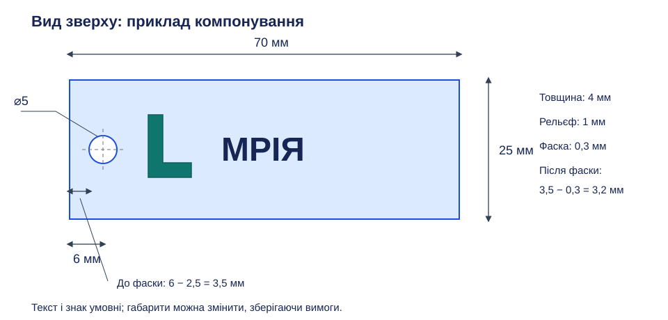

# Практична робота 2. Іменний брелок

## Тема

Поєднання витягування, текстового ескізу, логотипу, наскрізного вирізання та обробки ребер за матеріалами [уроку 9](../../Уроки/less-09/README.md) з опорою на уроки 6–8.

## Орієнтовний загальний час виконання

До 40 хвилин після короткої демонстрації текстового ескізу; власний SVG з роботи 1 або наданий учителем простий знак має бути готовий до початку.

## Мета роботи та вміння

Створити простий персоналізований виріб із кількома узгодженими елементами. Перевіряються побудова основи за розмірами, розміщення тексту та SVG, вибір Join і Cut, створення кріпильного отвору, застосування фасок або скруглень та пояснення порядку операцій.

## Завдання

Створіть брелок із коротким словом або ім’ям, власним логотипом і наскрізним отвором для кільця. Оберіть просту основу; обробіть краї отвору фаскою або скругленням. Кільце моделювати не потрібно, а реальні персональні дані можна замінити нейтральним словом.

*Рисунок 1. Авторський приклад брелка 70 × 25 мм: отвір ⌀5 мм із центром за 6 мм від лівого краю; мінімальна перемичка до краю становить 3,5 мм.*

## Вихідні дані, розміри та технічні вимоги

Межі товщини, рельєфу й отвору збережено з попереднього завдання. Приклад: прямокутна основа 70 × 25 × 4 мм, виступ тексту 1 мм, отвір ⌀5 мм у точці (6; 12,5) від нижнього лівого кута. Габарити основи й позиції напису можна змінити, зберігаючи всі вимоги.

| Елемент | Обов’язкова вимога |
| --- | --- |
| Основа | Проста довільна форма, товщина 3–5 мм |
| Напис | Слово з 3–10 символів, читабельне й повністю в межах основи |
| Текст і логотип | Виступ або заглиблення 0,8–2 мм; логотип обов’язковий |
| Отвір | Наскрізний, діаметр 4–6 мм |
| Відступ | Не менше 3 мм від краю отвору до зовнішнього краю основи |
| Обробка | Фаска або скруглення країв отвору без руйнування перемички |
| Результат | Одне цілісне тіло, без окремих літер чи фрагментів логотипу |

Відступ вимірюється від краю отвору, а не його центра: для прямого краю це відстань до центра мінус радіус. Після фаски або скруглення також має залишатися перемичка не менше 3 мм; у наведеному прикладі фаска 0,3 мм залишає 3,2 мм. Для заглиблення глибина має бути меншою за товщину основи. Це навчальні умови, які ще потребуватимуть перевірки для конкретного принтера.

## Послідовність виконання

1. Оберіть слово й підготуйте логотип. На ескізі розподіліть місце між отвором, знаком і написом; для довгого слова збільште основу або зменште текст, зберігаючи його читабельність. Не починайте з декоративної рамки.
2. Створіть визначений ескіз основи, задайте габарити та прив’язування. Витягніть основу на 3–5 мм і перевірте, що отримано одне тіло. Для овальної або фігурної основи також зафіксуйте її основні розміри.
3. На верхній грані створіть ескіз тексту. Введіть 3–10 символів і виберіть простий шрифт із замкнутими контурами літер; однолінійний шрифт для цього завдання не підходить. Перевірте рамку тексту й розташування відносно майбутнього отвору.
4. Створіть текстовий рельєф Extrude з Join або Cut. Задайте 0,8–2 мм та перевірте всі літери, зокрема внутрішні області. Якщо напис виходить за край, відредагуйте ескіз, а не обрізайте літери випадковим вирізанням.
5. В окремий ескіз верхньої грані вставте SVG. Змініть масштаб і положення так, щоб знак не перетинав текст або отвір. Створіть виступ чи заглиблення в тому самому діапазоні; виступ має приєднатися до основи.
6. Побудуйте коло кріплення та задайте діаметр і положення центра. Виріжте його наскрізь командою Extrude з Cut, перевіряючи напрямок і глибину. Огляньте нижню грань: заглиблення замість наскрізного отвору не виконує умову.
7. Додайте невелику фаску або скруглення на краї отвору; конкретний параметр оберіть за запасом матеріалу. При помилці зменште параметр і повторно перевірте відступ. Зовнішні ребра можна обробити відомими засобами, але це не замінює обробки отвору.
8. Збережіть модель і зафіксуйте основу з розмірами, текстовий ескіз, параметр рельєфу, логотип, отвір із положенням, обробку країв та повний результат. Для читабельного доказу отвору використайте вид зверху й додатковий вид знизу.

*Рисунок 2. Наявна ілюстрація можливих форм брелків; колір, декоративна рамка та фізичний друк зараз не є вимогами до результату.*

## Матеріали для перевірки

Подайте один звіт у форматі Markdown або PDF; робочі документи збережіть у власному навчальному проєкті для продовження роботи, але файл моделі або посилання на нього подавати не потрібно. Для роботи з кількома заняттями звіт спільний для всіх етапів. Слайсинг, експорт для принтера й фізичний друк виконуватимуться в блоці 3D-друку та зараз не оцінюються.

## Вимоги до звіту

На початку зазначте номер роботи, обраний варіант і фактичні розміри. Додайте пронумеровані скріншоти основних етапів у послідовності виконання; під кожним напишіть короткий змістовний підпис про виконану дію та її результат. Геометрія, розміри, параметри операцій і потрібні обмеження мають чітко читатися. Не використовуйте фотографію монітора замість скріншота.

Останній скріншот має показувати повний результат роботи в зручному масштабі без вікон, що перекривають модель; за потреби перед ним додайте інший вид для прихованих елементів. Для кожного обов’язкового пункту заповніть коротку таблицю:

| Вимога | Виконано | Доказ |
| --- | --- | --- |
| Назва конкретної вимоги | Так / частково / ні | № відповідного скріншота |

Для творчого 12-го бала додайте окремий текст: назвіть використану можливість, поясніть, чому її не розглядали у відповідних уроках, і опишіть, як вона покращила спосіб або якість виконання; наведіть номер скріншота-доказу. Без цього обґрунтування творчий бал не нараховується.

## Критерії оцінювання

Бали за обов’язкові вимоги нараховують за видимими доказами; невиконані складники відповідного критерію балів не дають, а частково виконаний критерій оцінюють у межах указаного максимуму.

| Критерій | Максимум балів |
| --- | --- |
| Основа та її товщина 3–5 мм | 2 |
| Напис 3–10 символів і рельєф 0,8–2 мм | 2 |
| Логотип у межах основи | 1 |
| Наскрізний отвір ⌀4–6 мм і перемичка не менше 3 мм | 2 |
| Обробка країв отвору та одне цілісне тіло | 2 |
| Повний звіт зі скріншотами та таблицею доказів | 2 |
| **Разом за обов’язкові вимоги** | **11** |
| Доречний творчий підхід з обґрунтуванням і скріншотом | 1 |
| **Разом** | **12** |

Творчий підхід — самостійне використання прийому або інструмента, якого не розглядали в уроках 6–9; він не повинен порушувати обов’язкові умови. Формальне застосування додаткової команди без впливу на спосіб або якість результату не зараховується. Декоративна складність сама по собі не компенсує помилок геометрії.

## Правила самостійного виконання та дозволені джерела

Виконуйте побудову самостійно; дозволено користуватися відповідними уроками, цією інструкцією та офіційною довідкою. Обговорення помилки з учителем допускається, але готову модель іншого виконавця не видавайте за власну. Якщо використано наданий учителем SVG, зазначте це у звіті; готові чужі вироби замість виконання завдання не допускаються.

[Текст в ескізах — Autodesk](https://help.autodesk.com/view/fusion360/ENU/?contextId=SKT-SKETCH-CREATE-TEXT) · [Insert SVG — Autodesk](https://help.autodesk.com/cloudhelp/ENU/Fusion-Model/files/SLD-INS-SVG.htm).

[До переліку практичних робіт](../README.md) · [До тематичного плану](../../README.md)
