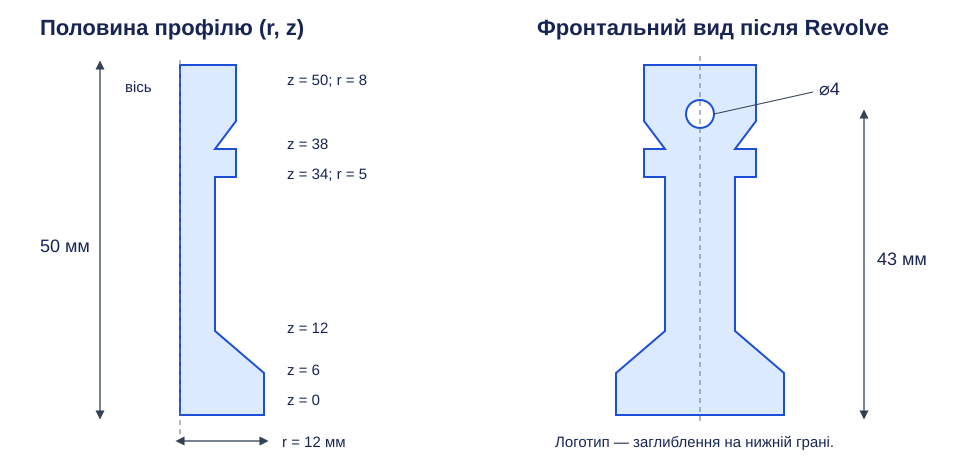
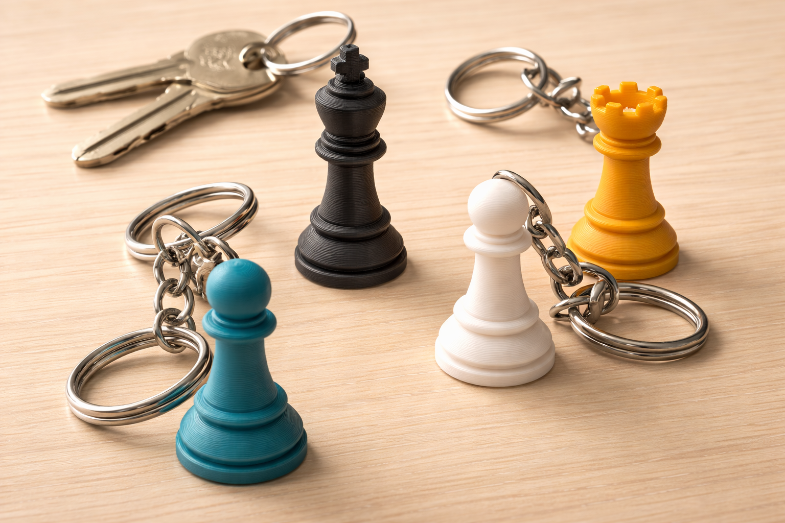

# Практична робота 3. Брелок у вигляді шахової фігури

## Тема

Створення обертальної форми командою Revolve та додавання кріпильного отвору й логотипу за матеріалами [уроку 10](../../Уроки/less-10/README.md) і тематичним планом уроку 11.

## Орієнтовний загальний час виконання

До 40 хвилин за наявності підготовленого SVG і розглянутого на уроці профілю; для основного варіанта оберіть просту фігуру без складних прорізів і дрібних прикрас.

## Мета роботи та вміння

Навчитися будувати об’ємну форму за профілем та віссю. Перевіряються замкнутість і визначеність ескізу, розрізнення радіуса й діаметра, вибір осі Revolve, повне обертання, поперечне вирізання отвору, обробка країв і збереження єдиного тіла.

## Завдання

Створіть спрощену шахову фігуру-брелок заввишки 40–70 мм зі стійкою основою, отвором і власним логотипом. Рекомендовано геометризований пішак: його можна побудувати простим профілем із відрізків. Інша фігура допустима, якщо її основну форму отримано Revolve і вона посильна для одного заняття.

*Рисунок 1. Авторський приклад: висота 50 мм, основа ⌀24 мм, шийка ⌀10 мм, головка ⌀16 мм; поперечний отвір ⌀4 мм із центром на висоті 43 мм.*

## Вихідні дані, розміри та технічні вимоги

Обов’язкові межі висоти й отвору збережено з попереднього завдання; інші числа рисунка 1 — навчальний варіант, який можна змінити. У профілі відкладають відстані від осі: 12 мм відповідає діаметру основи 24 мм, а не радіусу 24 мм.

| Елемент | Обов’язкова вимога |
| --- | --- |
| Основна форма | Створена Revolve з визначеного замкнутого профілю, поворот 360° |
| Висота | 40–70 мм |
| Основа | Плоска нижня опорна грань, достатньо широка для стійкого положення |
| Отвір | Поперечний наскрізний, діаметр 4–6 мм, не розриває фігуру |
| Краї отвору | Оброблені невеликою фаскою або скругленням |
| Логотип | Власний або наданий учителем SVG, рельєф чи заглиблення на плоскій ділянці |
| Цілісність | Одне тіло без відокремлених частин |

Для прикладу нижня основа має висоту 6 мм, перехід до шийки — до висоти 12 мм, шийка — до 34 мм, комір — до 38 мм, головка — до 50 мм. Отвір проходить горизонтально через головку, а не вздовж осі фігури. Залишайте матеріал довкола отвору; після обробки країв повторно перевірте, що головка не від’єднана.

Найпростіше додати невелике заглиблення логотипу на плоскій нижній грані основи, зберігши довкола нього суцільну опорну площину. Для основи завтовшки 6 мм можна використати глибину 0,8 мм; логотип має залишатися в межах грані. Такий спосіб не потребує обгортання SVG навколо кривої поверхні.

## Послідовність виконання

1. На вертикальній площині створіть ескіз половини поздовжнього перерізу. Вісь спрямована вгору; нижня точка профілю лежить на ній. Побудуйте зовнішню ламану лише з одного боку осі та замкніть область відрізком уздовж осі.
2. Задайте висоту, радіуси та рівні уступів, прив’яжіть профіль до початку координат. Допоміжна вісь не повинна перетворитися на зайву сторону всередині області; для обертання можна використати відповідну вісь початку координат. Профіль не має перетинати сам себе або переходити на інший бік осі.
3. Завершіть ескіз і виконайте Revolve: виберіть замкнуту область, вертикальну вісь і 360°. До підтвердження огляньте попередній результат. Якщо форма неправильна, виправте вибір осі чи профілю, а не створюйте друге тіло поверх першого.
4. На тій самій вертикальній площині створіть окремий ескіз кола отвору в головці. Задайте діаметр і висоту центра; для прикладу це 4 і 43 мм. Виріжте коло в обидва боки від площини так, щоб отвір вийшов на обидві поверхні, використовуючи Cut. Перевірте напрямок збоку.
5. Обробіть обидва вихідні краї отвору невеликою фаскою або скругленням. Якщо операція не виконується на кривій поверхні, перевірте вибір ребра й зменште параметр. Після обробки огляньте залишений матеріал біля шийки та верхівки.
6. Створіть ескіз на нижній плоскій грані, імпортуйте малий логотип і зробіть неглибокий Cut усередину основи. Не додавайте виступ під опорною гранню: він змінює умови стійкості. Після операції у браузері має залишитися одне тіло.
7. Перевірте висоту, діаметр отвору, рівність опорної площини й цілісність. Основна форма до отвору симетрична відносно осі; отвір і логотип є навмисними локальними змінами. Збережіть результат без обов’язкового експорту чи друку.
8. Для звіту покажіть профіль із розмірами й віссю, параметри Revolve, ескіз отвору та його наскрізність, оброблені краї, логотип знизу й загальний вигляд фігури. Останній кадр має охоплювати всю фігуру, а не лише головку.

*Рисунок 2. Наявна ілюстрація можливих силуетів; складні корони, хрест, колір і металеві кільця не є обов’язковими елементами роботи.*

## Матеріали для перевірки

Подайте один звіт у форматі Markdown або PDF; робочі документи збережіть у власному навчальному проєкті для продовження роботи, але файл моделі або посилання на нього подавати не потрібно. Для роботи з кількома заняттями звіт спільний для всіх етапів. Слайсинг, експорт для принтера й фізичний друк виконуватимуться в блоці 3D-друку та зараз не оцінюються.

## Вимоги до звіту

На початку зазначте номер роботи, обраний варіант і фактичні розміри. Додайте пронумеровані скріншоти основних етапів у послідовності виконання; під кожним напишіть короткий змістовний підпис про виконану дію та її результат. Геометрія, розміри, параметри операцій і потрібні обмеження мають чітко читатися. Не використовуйте фотографію монітора замість скріншота.

Останній скріншот має показувати повний результат роботи в зручному масштабі без вікон, що перекривають модель; за потреби перед ним додайте інший вид для прихованих елементів. Для кожного обов’язкового пункту заповніть коротку таблицю:

| Вимога | Виконано | Доказ |
| --- | --- | --- |
| Назва конкретної вимоги | Так / частково / ні | № відповідного скріншота |

Для творчого 12-го бала додайте окремий текст: назвіть використану можливість, поясніть, чому її не розглядали у відповідних уроках, і опишіть, як вона покращила спосіб або якість виконання; наведіть номер скріншота-доказу. Без цього обґрунтування творчий бал не нараховується.

## Критерії оцінювання

Бали за обов’язкові вимоги нараховують за видимими доказами; невиконані складники відповідного критерію балів не дають, а частково виконаний критерій оцінюють у межах указаного максимуму.

| Критерій | Максимум балів |
| --- | --- |
| Визначений замкнутий профіль та правильна вісь | 2 |
| Revolve 360°, висота 40–70 мм і плоска основа | 3 |
| Наскрізний отвір ⌀4–6 мм та обробка його країв | 2 |
| Логотип і збереження одного цілісного тіла | 2 |
| Повний звіт зі скріншотами та таблицею доказів | 2 |
| **Разом за обов’язкові вимоги** | **11** |
| Доречний творчий підхід з обґрунтуванням і скріншотом | 1 |
| **Разом** | **12** |

Творчий підхід — самостійне використання прийому або інструмента, якого не розглядали в уроках 6–11; він не повинен порушувати обов’язкові умови. Формальне застосування додаткової команди без впливу на спосіб або якість результату не зараховується. Декоративна складність сама по собі не компенсує помилок геометрії.

## Правила самостійного виконання та дозволені джерела

Виконуйте побудову самостійно; дозволено користуватися відповідними уроками, цією інструкцією та офіційною довідкою. Обговорення помилки з учителем допускається, але готову модель іншого виконавця не видавайте за власну. Якщо використано наданий учителем SVG, зазначте це у звіті; готові чужі вироби замість виконання завдання не допускаються.

[Revolve — Autodesk](https://help.autodesk.com/view/fusion360/ENU/?contextId=SLD-REVOLVE-SOLID) · [Insert SVG — Autodesk](https://help.autodesk.com/cloudhelp/ENU/Fusion-Model/files/SLD-INS-SVG.htm).

[До переліку практичних робіт](../README.md) · [До тематичного плану](../../README.md)
