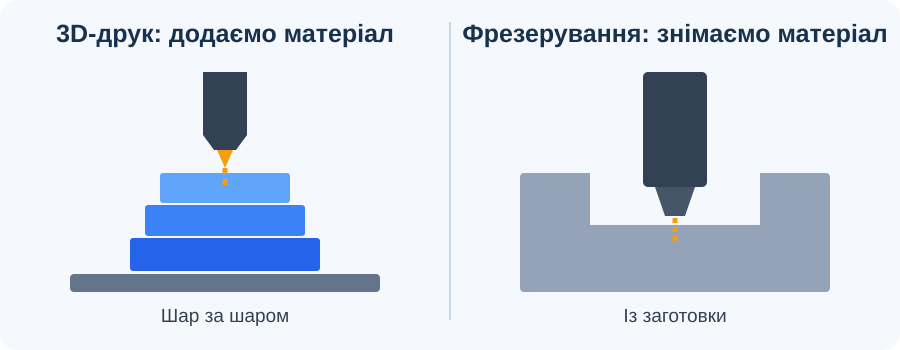

# Урок 1. Вступ. 3D-технології у виробництві

## Мета

Ознайомитися із застосуванням 3D-друку та верстатів із числовим програмним керуванням (ЧПК), навчитися розрізняти їхні способи виготовлення виробу.

## Основні поняття

*Рисунок 1. Під час 3D-друку матеріал додається шарами, а під час фрезерування знімається із заготовки.*

- **3D-модель** — цифрове представлення форми об’єкта.
- **3D-друк** — пошарове створення фізичного об’єкта за цифровою моделлю: матеріал додається там, де потрібна деталь.
- **ЧПК** — керування рухом інструмента за програмою. Наприклад, фрезерний верстат знімає матеріал із заготовки.

| Ознака | 3D-друк | Фрезерування на верстаті з ЧПК |
| --- | --- | --- |
| Спосіб виготовлення | Додавання матеріалу | Видалення матеріалу із заготовки |
| Приклад | Друк корпусу прототипу | Вирізання деталі з листа фанери |
| Що потрібно підготувати | 3D-модель і параметри друку | Модель або кресленик, інструмент і траєкторію обробки |

ЧПК охоплює різні верстати; порівняння в таблиці стосується саме фрезерування.

## Хід уроку

1. Розгляньте повсякденний предмет: тримач телефона, корпус пристрою або табличку. Які частини можна виготовити за цифровою моделлю?
2. Порівняйте два способи: надрукувати деталь шарами або вирізати її із заготовки. Назвіть матеріал, потрібне обладнання й можливі обмеження кожного способу.
3. Обговоріть приклади застосування 3D-друку: прототип виробу, індивідуальний тримач, навчальна модель механізму. Для кожного прикладу поясніть, навіщо потрібна цифрова модель.
4. Обговоріть приклади застосування верстатів із ЧПК: фрезерування панелі, гравіювання напису, вирізання деталей із листового матеріалу.

## Завдання

Знайдіть **три приклади використання 3D-друку**. Для кожного запишіть: назву виробу, його призначення, матеріал (якщо відомий) та посилання на джерело або власне спостереження. Поясніть, чому цей виріб доцільно виготовляти саме таким способом.

## Самоперевірка

1. Яка головна відмінність між пошаровим друком і фрезеруванням?
2. Для чого потрібна 3D-модель перед виготовленням деталі?
3. Чому один і той самий виріб іноді можна виготовити різними способами?

[До тематичного плану](../../README.md) · [Наступний урок](../less-02/README.md)
