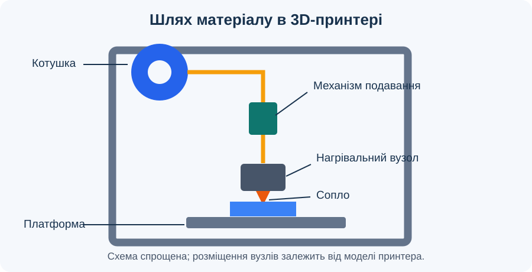

# Урок 2. Вступ до 3D-друку

## Мета

Зрозуміти принцип пошарового виготовлення та навчитися називати основні вузли принтера, що друкує розплавленим полімером.

## Терміни та скорочення

- **3D** — від англійського *three-dimensional*, «тривимірний»; опис об’єкта з урахуванням трьох вимірів: довжини, ширини та висоти.
- **3D-модель** — цифрове представлення форми об’єкта у тривимірному просторі.
- **3D-друк** — пошарове створення фізичного об’єкта за цифровою моделлю шляхом додавання матеріалу.
- **ЧПК** — числове програмне керування; керування рухами та операціями обладнання за програмою. У цьому уроці скорочення вжито під час повторення попередньої теми.
- **Слайсер** — програма, яка поділяє цифрову модель на шари й готує інструкції для принтера з урахуванням налаштувань друку.
- **Слайсинг** — підготовка моделі у слайсері: визначення шарів і формування інструкцій для їх побудови.
- **Шар друку** — частина виробу певної товщини, яку принтер формує на одному етапі пошарової побудови.
- **Полімерна нитка, або філамент** — матеріал у вигляді нитки, який подається до нагрівального вузла принтера та використовується для формування виробу.
- **Сопло** — деталь з отвором, через який нагрітий матеріал виходить і укладається під час друку.
- **Друкувальна платформа** — поверхня, на якій починається побудова та утримується деталь під час друку.
- **Привід** — механізм, що забезпечує рух вузлів принтера; **напрямні** задають напрямок їх переміщення.
- **Траєкторія друку** — заданий шлях переміщення сопла відносно деталі під час формування шару.
- **Заповнення** — внутрішня структура надрукованої деталі; може бути суцільною або містити порожнини за заданим рисунком.
- **Фотополімерна смола** — рідкий матеріал, який твердне під дією світла відповідного діапазону та використовується в окремих способах 3D-друку.
- **Порошковий друк** — група способів 3D-друку, у яких виріб формують послідовним з’єднанням визначених ділянок шарів порошку.

## Як утворюється виріб

Цифрову 3D-модель готують у програмі для нарізання на шари — **слайсері**. Вона створює інструкції для принтера. Під час друку матеріал укладається шар за шаром. Готовий виріб знімають лише після завершення роботи та охолодження поверхонь.

```text
3D-модель → слайсер → інструкції для принтера → друк шарами → виріб
```

## Будова принтера з подаванням полімерної нитки



*Рисунок 1. Спрощена схема: від котушки нитка надходить до сопла, а деталь формується на платформі.*

| Вузол | Призначення |
| --- | --- |
| Котушка з полімерною ниткою | Запас матеріалу для друку |
| Механізм подавання | Просуває нитку до нагрівального вузла |
| Нагрівальний вузол і сопло | Розплавляють та подають матеріал |
| Друкувальна платформа | Утримує деталь під час виготовлення |
| Приводи й напрямні | Переміщують друкувальну головку або платформу |

Розташування вузлів залежить від конструкції конкретного принтера.

## Інші способи 3D-друку

- Друк із полімерної нитки: розплавлений матеріал укладається через сопло.
- Друк із фотополімерної смоли: рідкий матеріал твердне під дією світла.
- Порошковий друк: окремі ділянки шару порошку з’єднуються під дією джерела енергії або іншого технологічного процесу.

## Хід уроку

### 1. Вступ і актуалізація знань

- Оголосіть тему та ключове запитання: як принтер перетворює цифрову модель на об’ємний предмет?
- Пригадайте матеріал першого уроку: під час 3D-друку матеріал додається, а під час фрезерування знімається із заготовки. Попросіть навести один приклад надрукованого виробу.
- Розгляньте зразок, якщо він доступний, або рисунок 1. Запропонуйте пояснити, чому об’єкт не утворюється одразу в повному об’ємі.
- Визначте завдання заняття: простежити утворення шарів, знайти основні вузли принтера та пояснити їхню взаємодію.

### 2. Від цифрової моделі до інструкцій для принтера

- Простежте послідовність у схемі «Як утворюється виріб». Розмежуйте цифрову модель, підготовку друку та фізичне виготовлення.
- Поясніть роль слайсера: програма поділяє модель на шари й готує інструкції для роботи принтера відповідно до вибраних налаштувань.
- На прикладі кубика уявно розділіть модель на горизонтальні перерізи. Порівняйте їх зі стосом однакових карток, який утворює об’єм.
- Обговоріть, як змінюватиметься форма перерізів у піраміди: ближче до вершини вони ставатимуть меншими. Зробіть висновок, що шари одного виробу можуть мати різні контури.
- Поставте запитання: чому недостатньо лише показати принтеру зображення предмета? Підведіть до потреби визначити рухи, подавання матеріалу та порядок побудови шарів.

### 3. Будова принтера та шлях матеріалу

- За рисунком 1 і таблицею знайдіть котушку, механізм подавання, нагрівальний вузол із соплом, платформу, приводи й напрямні. Якщо є реальний принтер, порівняйте його будову зі схемою під керівництвом учителя.
- Простежте шлях полімерної нитки: котушка → механізм подавання → нагрівальний вузол → сопло → матеріал на платформі. Поясніть, на якій ділянці нитка розм’якшується та плавиться.
- Розмежуйте функції: механізм подавання просуває нитку, нагрівальний вузол нагріває матеріал, а сопло спрямовує його вихід під час укладання.
- Поясніть роль платформи: на ній починається формування деталі, яка має залишатися на місці протягом друку.
- Покажіть, що приводи забезпечують рух, а напрямні задають його напрямок. Залежно від конструкції переміщуються друкувальна головка, платформа або обидва вузли.
- Запропонуйте вправу в парах: один учень називає вузол, інший пояснює його функцію без читання таблиці; потім учні міняються ролями.

### 4. Послідовність пошарового виготовлення

- Опишіть початок процесу: після підготовки обладнання за його інструкцією принтер укладає матеріал першого шару на платформу.
- Поясніть утворення шару: сопло рухається за заданою траєкторією, а матеріал подається узгоджено з рухом. Контур і внутрішні ділянки формуються відповідно до підготовлених інструкцій.
- Простежте перехід до наступного шару: взаємне положення сопла й платформи змінюється за висотою, після чого матеріал укладається поверх попереднього шару.
- Зверніть увагу, що всередині виріб не обов’язково суцільний: спосіб заповнення задають під час підготовки друку. Детальне налаштування розглядатиметься на наступних заняттях курсу.
- Попросіть пояснити, чому потрібна узгоджена робота подавання, нагрівання та переміщення. Завершіть опис перевіркою готової деталі після завершення друку й охолодження поверхонь.

### 5. Аналіз навчальних ситуацій

- Розгляньте ситуацію «нитка перестала подаватися». Запропонуйте пояснити наслідок: без надходження матеріалу потрібні ділянки наступних шарів не сформуються.
- Обговоріть ситуацію «деталь від’єдналася від платформи». Поясніть, що її положення може змінитися, тоді як принтер продовжуватиме рух за підготовленими інструкціями.
- Розгляньте ситуацію «форма моделі правильна, але розмір не підходить». Попросіть назвати, що варто перевірити: задані розміри моделі та масштаб під час підготовки друку.
- Для кожного випадку розділіть спостереження й припущення: що видно, який вузол або етап може бути пов’язаний із проблемою, яких даних бракує для висновку.
- Наголосіть, що ці ситуації аналізують усно. Про несправність реального обладнання повідомляють учителю; втручатися в роботу рухомих або нагрітих вузлів не можна.

### 6. Порівняння способів 3D-друку

- Поверніться до розділу «Інші способи 3D-друку». Назвіть початковий матеріал для кожного способу: полімерна нитка, рідка фотополімерна смола, порошок.
- Зіставте спосіб формування шару: укладання розплавленого матеріалу через сопло, затвердіння смоли світлом, з’єднання окремих ділянок порошкового шару.
- Визначте спільну ознаку: об’єкт утворюється пошарово за цифровою моделлю. Поясніть, що будова обладнання залежить від способу роботи з матеріалом.
- Поставте запитання: чи потрібна котушка нитки принтеру, який працює зі смолою? Використайте відповідь, щоб уточнити межі застосування розглянутої схеми принтера.

### 7. Закріплення та підведення підсумків

- Перейдіть до завдання нижче: учні малюють спрощену схему, підписують вузли й показують стрілками шлях матеріалу. Поясніть, що важливі правильні зв’язки між вузлами, а не художня точність малюнка.
- Організуйте взаємоперевірку в парах: чи позначено щонайменше п’ять вузлів із таблиці, чи правильно показано шлях нитки та місце формування деталі?
- Запропонуйте усно завершити речення: «Слайсер потрібний для…», «Механізм подавання…», «Наступний шар утворюється…».
- Перевірте розуміння запитаннями: чим відрізняються модель та інструкції для принтера; чому деталь має утримуватися на платформі; що спільного в різних способів 3D-друку?
- Підведіть підсумки: кожен учень називає один вузол і його функцію, а також одне питання, яке потребує додаткового пояснення.

## Завдання

Намалюйте спрощену схему принтера з полімерною ниткою. Підпишіть щонайменше п’ять вузлів із таблиці та стрілкою покажіть шлях матеріалу від котушки до деталі. Усно поясніть призначення кожного вузла.

## Безпека

Не торкайтеся сопла й платформи під час роботи та одразу після завершення друку: вони можуть бути гарячими. Роботу з обладнанням виконуйте за інструкцією до конкретної моделі та під наглядом учителя.

[До тематичного плану](../../README.md) · [Попередній урок](../less-01/README.md) · [Наступний урок](../less-03/README.md)
