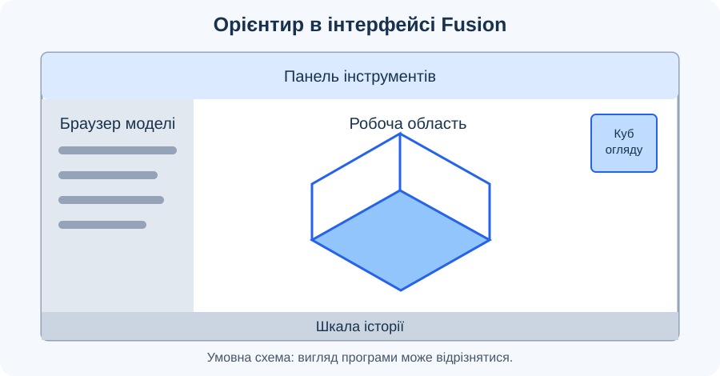
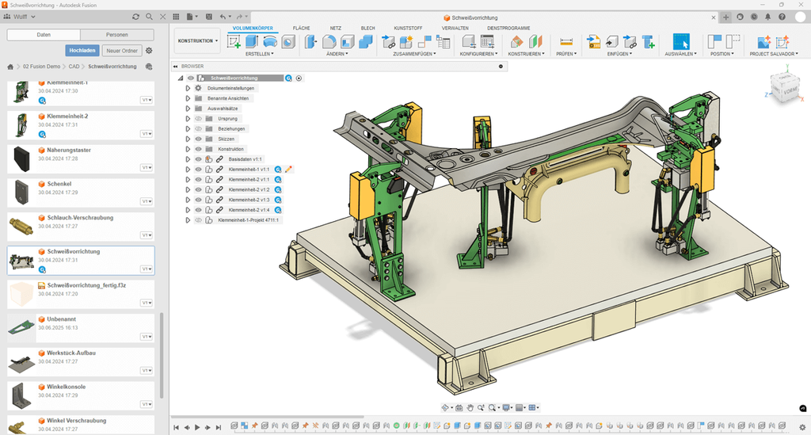

# Урок 3. Інтерфейс Autodesk Fusion 360

## Мета

Зрозуміти призначення CAD-системи, навчитися орієнтуватися в інтерфейсі Autodesk Fusion та переглядати модель у 3D-просторі.

## Терміни та скорочення

- **CAD** — від англійського *Computer-Aided Design*, автоматизоване проєктування; CAD-система допомагає створювати й редагувати цифрові кресленики та моделі.
- **3D** — від англійського *three-dimensional*, «тривимірний»; модель описує форму об’єкта у трьох вимірах.
- **Проєкт** — простір для організації пов’язаних документів і папок; може містити кілька моделей.
- **Документ моделі** — окремий документ Fusion, у якому зберігаються геометрія та структура моделі.
- **Ескіз** — плоска геометрія, на основі якої можна створювати об’ємні елементи.
- **Полотно (Canvas)** — ділянка вікна, у якій відображається модель; на рисунку 1 позначена як «Робоча область».
- **Робоче середовище (Workspace)** — набір інструментів для певного виду роботи, наприклад проєктування в середовищі Design.
- **Браузер моделі (Browser)** — дерево складників поточного документа; його не слід плутати з веббраузером або переліком проєктів.
- **Поворот огляду (Orbit)** — зміна напрямку погляду на модель без зміни її геометрії.
- **Зсув огляду (Pan)** — переміщення зображення моделі в межах полотна без переміщення самої деталі.
- **Наближення й віддалення (Zoom)** — зміна масштабу відображення без зміни розмірів моделі.
- **Ізометричний вид** — спосіб огляду, за якого видно об’єкт із трьох боків, а координатні осі мають однакове масштабне скорочення.

## Основні частини інтерфейсу

*Рисунок 1. Орієнтир для пошуку робочої області, браузера моделі, панелі інструментів, куба огляду та шкали історії.*

*Рисунок 2. Наявний приклад німецькомовного інтерфейсу Fusion: ліворуч панель даних і браузер моделі, у центрі модель, унизу засоби навігації та шкала історії.*

**CAD-система** допомагає створювати й змінювати цифрові кресленики та моделі. У Fusion робота з деталлю може починатися з плоского ескізу, на основі якого згодом створюють об’ємну форму.

| Частина інтерфейсу | Для чого потрібна |
| --- | --- |
| Полотно (Canvas; на схемі — робоча область) | Перегляд і редагування геометрії |
| Панель інструментів | Вибір команд створення й редагування |
| Панель даних (Data Panel) | Доступ до проєктів, папок і документів |
| Браузер моделі | Перегляд складників поточного документа |
| Куб огляду | Перемикання стандартних напрямків погляду |
| Панель навігації | Поворот, зсув, наближення та віддалення огляду |
| Шкала історії | Перегляд послідовності операцій, якщо запис історії увімкнено |

Назви та розташування елементів можуть трохи відрізнятися залежно від версії та налаштувань програми.

## Хід уроку

### 1. Вступ і зв’язок із попередніми уроками

- Пригадайте шлях від задуму до виробу. Визначте місце CAD-системи: створення та уточнення цифрової моделі перед підготовкою виготовлення.
- Розмежуйте призначення Fusion як засобу моделювання та слайсера як засобу підготовки друку, розглянутого на попередньому уроці.
- Сформулюйте завдання заняття: знайти основні елементи інтерфейсу, організувати власний документ і навчитися оглядати готову модель.

### 2. Ознайомлення з інтерфейсом

- Відкрийте Fusion у доступному навчальному обліковому записі. Якщо спочатку відображається сторінка Home, відкрийте або створіть документ для переходу до моделювання.
- Зіставте рисунки 1 і 2 з вікном програми. Знайдіть полотно, панель інструментів, браузер моделі, куб огляду та панель навігації.
- Поясніть різницю між полотном і робочим середовищем: полотно показує модель, а вибір середовища визначає доступні інструменти. Для заняття використовуйте середовище Design.
- Покажіть панель даних: тут шукають проєкти й документи. У браузері моделі шукають складники вже відкритого документа.
- Наведіть вказівник на кілька кнопок і прочитайте підказки. Зверніть увагу, що назви залежать від мови інтерфейсу, а розташування може відрізнятися від наявного скріншота.
- Знайдіть шкалу історії, якщо запис історії увімкнено. У новому документі вона може ще не містити операцій.

### 3. Створення проєкту та документа

- Поясніть на прикладі: проєкт «Навчальні моделі» може містити документи різних виробів; назва проєкту не замінює назви документа.
- Через доступні засоби Home або панелі даних створіть проєкт «Навчальні моделі». Якщо прав на створення немає, повідомте вчителя й використайте призначений для роботи проєкт.
- Створіть новий документ командою New Design. Перевірте його вкладку та відмінність між порожнім полотном і переліком документів у проєкті.
- Збережіть документ під назвою «Навігація», вибравши потрібний проєкт і папку, якщо вона використовується. Запишіть місце збереження.

TODO: додати реальний скріншот вікна збереження документа «Навігація» у навчальному проєкті з установленої версії Fusion; приховати персональні дані облікового запису.

*Рисунок 3. Збереження документа: назва, проєкт і папка розміщення (місце для скріншота).*

### 4. Стандартні види та орієнтація моделі

- Відкрийте в окремій вкладці готову навчальну модель, надану вчителем, або доступний зразок. Оберіть об’єкт із помітними відмінностями між верхом і передньою частиною, наприклад корпус з отвором.
- Поясніть, що навігацію зручніше відпрацьовувати на готовій геометрії: у порожньому документі зміни огляду менш помітні. Створення власної геометрії почнеться на наступних уроках.
- За допомогою граней куба огляду перейдіть до виду зверху, спереду та збоку. Назвіть, які елементи моделі видно в кожному положенні.
- Виберіть кут куба для огляду з трьох боків. Порівняйте його зі стандартними видами й обговоріть, коли зручніше використовувати кожен із них.
- Попросіть учнів показати один і той самий отвір або виступ у різних видах. Підкресліть, що змінюється погляд на предмет, а не його будова.

### 5. Поворот, зсув і масштаб огляду

- На панелі навігації знайдіть Orbit, Pan і Zoom. Виконайте кожну дію окремо, спостерігаючи за результатом.
- Поверніть огляд так, щоб побачити інший бік моделі; зсуньте її зображення ближче до краю полотна; наблизьте окремий елемент і знову віддаліть модель.
- Використайте Fit для повернення всієї моделі в межі полотна. Поясніть, що зникнення об’єкта за краєм екрана після навігації не означає його видалення.
- Перевірте підказки й налаштування навігації для миші або сенсорної панелі. Поєднання клавіш і кнопок залежать від вибраної схеми керування.
- Розмежуйте зсув огляду та переміщення деталі командою редагування: для цієї вправи потрібні лише засоби навігації.
- Організуйте роботу в парах: один учень називає потрібну дію, другий виконує її та пояснює, що змінилося на екрані.

TODO: додати реальний скріншот простої навчальної моделі з позначеними кубом огляду та командами Orbit, Pan, Zoom і Fit на панелі навігації.

*Рисунок 4. Засоби навігації для огляду навчальної моделі (місце для скріншота).*

### 6. Перевірка збереження й аналіз труднощів

- Поверніться до вкладки документа «Навігація». Перевірте назву, завершення збереження та його наявність у вибраному проєкті; повторно відкрийте документ.
- Якщо документ не знайдено, перевірте активний проєкт і папку. Не створюйте дублікати, доки не з’ясуєте місце збереження.
- Якщо модель не видно, перевірте активну вкладку й застосуйте Fit. Якщо це не допомогло, разом з учителем перевірте видимість її складників у браузері.
- Якщо назви кнопок відрізняються від рисунка 2, орієнтуйтеся на призначення та підказки. Не змінюйте налаштування програми навмання.

### 7. Закріплення та підведення підсумків

- Виконайте завдання нижче: покажіть частини інтерфейсу та продемонструйте навігацію на готовій моделі.
- Запропонуйте завершити речення: «У панелі даних я знаходжу…», «У браузері моделі я бачу…», «Під час наближення розміри деталі…».
- Обговоріть запитання для самоперевірки. Попросіть пояснити різницю між організацією документів, оглядом моделі та редагуванням її геометрії.
- Підведіть підсумки: кожен учень називає опановану дію та одну дію, яку потрібно повторити перед початком роботи з ескізами.

## Завдання

Покажіть учителю або однокласнику чотири частини інтерфейсу з таблиці. Продемонструйте поворот, наближення та зсув огляду; відкрийте створений проєкт і документ.

## Самоперевірка

1. Чим документ моделі відрізняється від проєкту, у якому він зберігається?
2. Який елемент допомагає швидко перейти до виду зверху?
3. Чи змінюється геометрія деталі, коли ви лише повертаєте огляд?

## Довідка

- [Офіційна довідка Autodesk Fusion](https://help.autodesk.com/view/fusion360/ENU/).
- [Основні елементи інтерфейсу](https://help.autodesk.com/cloudhelp/ENU/Fusion-GetStarted/files/GS-THE-FUSION-INTERFACE.htm).
- [Базові дії з документами та проєктами](https://help.autodesk.com/cloudhelp/ENU/Fusion-GetStarted/files/GS-BASIC-OPERATIONS.htm).

[До тематичного плану](../../README.md) · [Попередній урок](../less-02/README.md) · [Наступний урок](../less-04/README.md)
