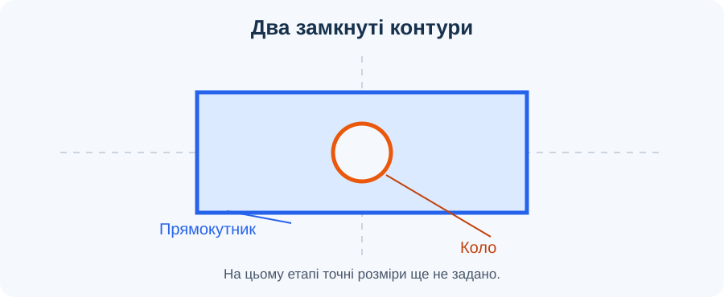
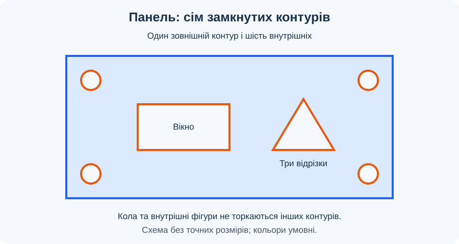

# Урок 4. Перший ескіз

## Мета

Навчитися створювати плоский ескіз і використовувати базові геометричні примітиви: відрізок, прямокутник і коло.

## Що таке ескіз

*Рисунок 1. Простий ескіз пластини з отвором до нанесення розмірів.*

Ескіз — це геометрія на вибраній площині. Замкнуті контури можна згодом використовувати для створення об’ємної деталі. Для точного виготовлення розміри й геометричні обмеження будуть додані на [наступному уроці](../less-05/README.md).

## Терміни та скорочення

- **CAD** — *Computer-Aided Design*, автоматизоване проєктування; засоби створення цифрової геометрії та моделей.
- **Площина ескізу** — плоска основа, на якій розміщується геометрія поточного ескізу.
- **Початок координат** — точка перетину координатних осей, орієнтир для розміщення геометрії.
- **Геометричний примітив** — базовий елемент побудови, наприклад відрізок, прямокутник або коло.
- **Контур** — лінія або послідовність з’єднаних ліній; у замкнутого контуру немає вільних кінців.
- **Профіль** — замкнута плоска область, обмежена геометрією ескізу; її можна вибирати для подальших операцій.
- **Вершина** — точка з’єднання сторін контуру. Близьке розташування кінців ще не означає їхнього з’єднання.
- **Діаметр** — відрізок через центр кола між двома його точками; дорівнює двом радіусам.
- **Геометричне обмеження** — умова взаємного розташування елементів, наприклад збіг точок. Детальне вивчення передбачене на уроці 5.

## Інструменти

| Інструмент | Результат | На що звернути увагу |
| --- | --- | --- |
| Відрізок (Line) | Пряма лінія між двома точками | Кінці мають збігатися з потрібними вершинами |
| Прямокутник (2-Point Rectangle) | Чотири сторони замкнутого контуру | Виберіть початкову й протилежну вершини |
| Коло (Center Diameter Circle) | Замкнутий круговий контур | Задайте центр і діаметр |

## Хід уроку

Орієнтовний час роботи — **35 хвилин**, із додатковим завданням — **40 хвилин**. Відлік починається після запуску Fusion й входу до навчального облікового запису. Це методичний розподіл часу заняття.

| Етап | Час |
| --- | --- |
| Аналіз завдання та підготовка документа | 4 хв |
| Тренувальний ескіз | 5 хв |
| Зовнішній контур і чотири кола | 8 хв |
| Прямокутне вікно та трикутник | 7 хв |
| Пошук і виправлення помилок | 6 хв |
| Взаємоперевірка та збереження | 5 хв |
| Разом: основне завдання | 35 хв |
| Додаткове завдання за готовністю | 5 хв |

### 1. Аналіз завдання та підготовка — 4 хв

- Розгляньте рисунок 2. Визначте складові панелі: один зовнішній прямокутник, чотири кола, одне прямокутне вікно та один трикутний контур.
- Обговоріть призначення елементів: кола позначають майбутні кріпильні отвори, прямокутник — вікно, трикутник — умовний виріз. На цьому етапі це лише плоскі контури, а не отвори в об’ємному тілі.
- Створіть документ «Панель — перший ескіз» і збережіть його в навчальному проєкті. Знайдіть команду Create Sketch.
- Виберіть площину XY. Поясніть, що всі елементи одного плоского ескізу мають належати цій площині.

### 2. Тренувальний ескіз — 5 хв

- У першому ескізі повторіть рисунок 1: побудуйте прямокутник за двома протилежними вершинами та коло всередині нього.
- Потренуйтеся припиняти поточну команду клавішею Esc, щоб наступне клацання не створювало зайву геометрію.
- Поруч побудуйте два з’єднані відрізки. Поясніть, чому така ламана ще не обмежує замкнуту область; додайте третій відрізок до початкової точки.
- Видаліть лише тренувальний трикутник, зберігши прямокутник із колом. Завершіть ескіз командою Finish Sketch та назвіть його «Тренування».
- Приховайте тренувальний ескіз у браузері й створіть другий на площині XY. Назвіть його «Панель»: основне завдання виконується в ньому.

### 3. Зовнішній контур і кріплення — 8 хв

- Побудуйте широкий прямокутник із приблизним співвідношенням ширини до висоти 2:1. Розмістіть його так, щоб залишалося достатньо місця для всіх внутрішніх елементів.
- Створіть чотири кола, по одному біля кожного кута. Дотримуйтеся приблизно однакового діаметра та візуально подібних відступів.
- Переконайтеся, що жодне коло не торкається зовнішнього контуру. Залишайте помітний проміжок, щоб майбутні отвори не виходили на край пластини.
- Після кожного кола перевіряйте його положення. Невдалу останню дію скасуйте й повторіть побудову; не накладайте нове коло поверх помилкового.
- Покажіть сусіду по робочому місцю п’ять замкнутих контурів: зовнішній прямокутник і чотири кола. Точну рівність розмірів на цьому уроці не встановлюйте.

### 4. Вікно та контур із відрізків — 7 хв

- Ліворуч від середини панелі побудуйте внутрішній прямокутник — вікно. Залиште проміжки до кіл і зовнішніх сторін.
- Праворуч побудуйте трикутник інструментом Line: послідовно вкажіть три вершини, а кінцеву точку третього відрізка сумістіть із першою.
- Під час замикання використовуйте прив’язування до наявної кінцевої точки. Самого візуального накладання на малому масштабі недостатньо.
- Завершіть команду побудови й перевірте, що трикутник не має четвертого зайвого відрізка та не перетинає інші контури.
- Порахуйте результат: сім замкнутих контурів, із яких шість внутрішніх. Для побудови використано два прямокутники, чотири кола та три відрізки.

### 5. Пошук і виправлення помилок — 6 хв

- У палітрі ескізу ввімкніть відображення профілів (Show Profile), якщо воно вимкнене. Перевірте, чи розпізнається область усередині трикутника та прямокутного вікна.
- Виконайте контрольований дослід: видаліть одну сторону трикутника й спостерігайте за зміною профілю. Відновіть її командою Undo та поясніть результат.
- Якщо профіль не з’являється, наблизьте кожну вершину. Шукайте розрив, зайвий відрізок або накладену геометрію; за потреби видаліть помилковий елемент і побудуйте його між наявними вершинами.
- Перевірте проміжки між внутрішніми контурами. Дотик або перетин змінює структуру областей і не відповідає завданню.
- Поясніть різницю: замкнутий ескіз уже придатний для вибору профілів, але без потрібних розмірів та обмежень він ще не є точно визначеним.

### 6. Взаємоперевірка та підведення підсумків — 5 хв

- Обміняйтеся перевіркою з однокласником: один показує елементи, другий звіряє їх із переліком нижче. Назвіть одну знайдену помилку або підтвердіть виконання всіх пунктів.
- Завершіть ескіз і збережіть документ. Перевірте в браузері наявність двох ескізів, прихований стан «Тренування» та видимість «Панелі».
- Поясніть, як відрізнити розрив від просто вимкненого відображення профілів і чому коло в ескізі ще не є фізичним отвором.
- Запишіть, які величини потрібно буде задати на уроці 5: габарити панелі, діаметри кіл, відступи та розміри внутрішніх елементів.

## Завдання

Побудуйте ескіз панелі за рисунком 2. Основний результат — сім замкнутих контурів без перетинів і випадкової геометрії. Дотримуйтеся взаємного розташування елементів; наведена схема не задає точних розмірів.

*Рисунок 2. Панель із шістьма внутрішніми контурами: колами кріплення, прямокутним вікном і трикутним вирізом. Схема без точних розмірів.*

**Додаткове завдання — 5 хвилин.** Після перевірки основного ескізу створіть окремий ескіз «Варіант» на тій самій площині, приховавши «Панель». Інструментом Line побудуйте замкнутий зовнішній контур панелі зі зрізаним верхнім правим кутом: він має складатися з п’яти відрізків. Додайте всередині два кола без перетинів із контуром. Перевірте замкнутість та поясніть, чим цей варіант відрізняється від прямокутної основи. Основний ескіз збережіть для подальшої роботи.

## Перевірка результату

- Основний ескіз «Панель» містить один зовнішній та шість внутрішніх замкнутих контурів.
- Чотири кола розташовані біля кутів, прямокутне вікно — ліворуч, трикутник — праворуч.
- Усі внутрішні контури відокремлені один від одного та від зовнішнього контуру.
- Трикутник складається рівно з трьох з’єднаних відрізків; його внутрішня область розпізнається як профіль.
- Немає випадкових відрізків, розривів і накладених дублікатів.
- Документ збережений під зрозумілою назвою; тренувальний ескіз приховано.
- Учень може пояснити порядок побудови та показати, як перевіряв замкнутість. Точні розміри й повне визначення ескізу перевірятимуться після уроку 5.

## Довідка

[Ескізи у Fusion — офіційна довідка Autodesk](https://help.autodesk.com/view/fusion360/ENU/?contextId=SKT-3D-SKETCH).

- [Прямокутники в ескізах](https://help.autodesk.com/cloudhelp/ENU/Fusion-Sketch/files/SKT-SKETCH-CREATE-RECTANGLES.htm).
- [Побудова кіл](https://help.autodesk.com/cloudhelp/ENU/Fusion-Sketch/files/SKT-CREATE-CIRCLES.htm).

[До тематичного плану](../../README.md) · [Попередній урок](../less-03/README.md) · [Наступний урок](../less-05/README.md)
