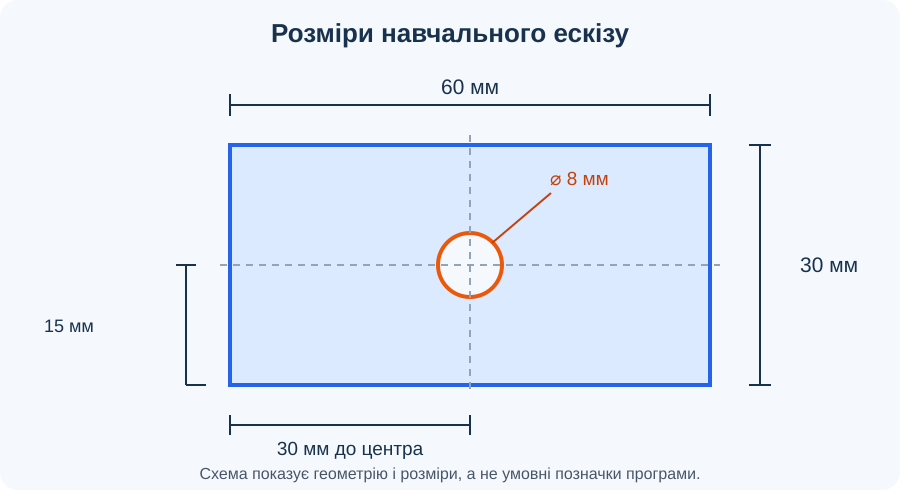

# Урок 5. Геометричні обмеження та розміри

## Мета

Навчитися керувати формою й положенням ескізу за допомогою геометричних обмежень і числових розмірів.

## Геометричні обмеження

*Рисунок 1. Навчальний приклад нанесення розмірів на ескіз пластини.*

Обмеження задають відношення між елементами ескізу. Розміри визначають числові значення, наприклад довжину сторони або діаметр кола.

| Обмеження | Що забезпечує |
| --- | --- |
| Горизонтальність / вертикальність | Напрямок відрізка |
| Збіг | Спільне положення точок або точки на кривій |
| Рівність | Однаковий розмір вибраних елементів |
| Паралельність | Однаковий напрямок прямих |
| Перпендикулярність | Прямий кут між прямими |
| Концентричність | Спільний центр кіл або дуг |

**Повністю визначений ескіз** не має вільного переміщення чи зміни розміру: його форму й положення визначають обмеження та розміри. Якщо після додавання нового обмеження виникає помилка, перевірте, чи не дублює воно вже задані умови.

## Хід уроку

1. Відкрийте ескіз пластини з [уроку 4](../less-04/README.md) або створіть новий.
2. Переконайтеся, що кути прямокутника залишаються прямими, а його сторони горизонтальні або вертикальні. Якщо потрібного обмеження немає, додайте його.
3. Додайте числові розміри: ширина пластини **60 мм**, висота **30 мм**, діаметр отвору **8 мм**. Це розміри навчального прикладу, а не вимога до майбутніх виробів.
4. Задайте положення центра отвору: **30 мм** від лівого краю та **15 мм** від нижнього краю. За цих значень отвір опиниться посередині пластини.
5. Спробуйте перетягнути елементи ескізу. Якщо щось іще рухається, знайдіть невизначений розмір або положення та додайте відповідний зв’язок.
6. Змініть ширину пластини з 60 на **70 мм**. Перевірте, чи центр отвору залишився посередині. Якщо ні, змініть його горизонтальне положення на **35 мм** або застосуйте зв’язок із серединою відповідної геометрії. Поверніть ширину 60 мм і збережіть документ.

## Завдання

Створіть ескіз деталі за наведеними розмірами. Застосуйте геометричні обмеження та перевірте, що форма і положення елементів не змінюються випадково. Поясніть, які умови визначають ширину, висоту, діаметр і положення отвору.

## Перевірка результату

- Зовнішній контур замкнутий, отвір не перетинає його.
- Розміри відповідають навчальному прикладу: 60 × 30 мм, отвір діаметром 8 мм.
- Центр отвору розташований на відстані 30 мм і 15 мм від відповідних країв.
- Ескіз збережено; невизначені елементи виявлено й, за можливості, усунуто.

## Довідка

- [Геометричні обмеження — Autodesk](https://help.autodesk.com/cloudhelp/ENU/Fusion-Sketch/files/SKT-CONSTRAINTS.htm).
- [Нанесення розмірів — Autodesk](https://help.autodesk.com/view/fusion360/ENU/?contextId=SKT-CREATE-DIMENSIONS).
- [Повне визначення ескізу — Autodesk](https://help.autodesk.com/cloudhelp/ENU/Fusion-Sketch/files/SKT-FULLY-DEFINE-CONSTRAIN-SKETCH.htm).

[До тематичного плану](../../README.md) · [Попередній урок](../less-04/README.md)
