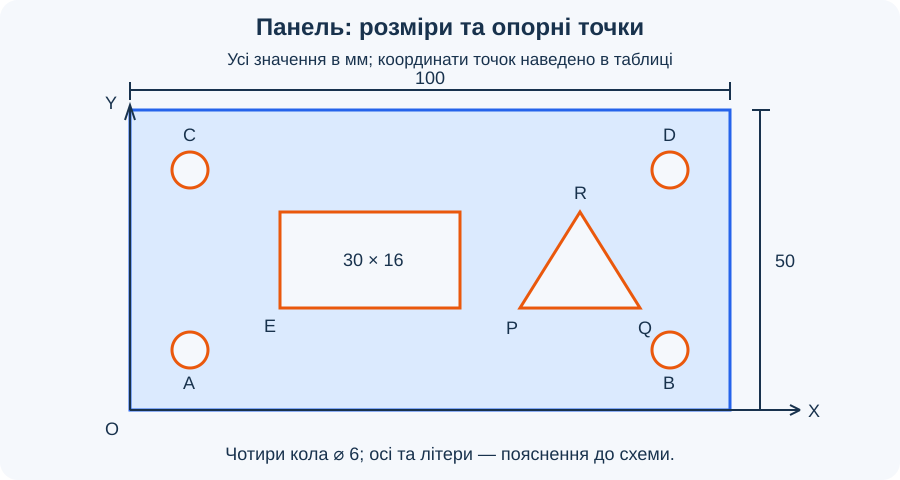

# Урок 5. Геометричні обмеження та розміри

## Мета

Навчитися керувати формою й положенням ескізу за допомогою геометричних обмежень і числових розмірів.

## Геометричні обмеження

*Рисунок 1. Навчальний приклад нанесення розмірів на ескіз пластини.*

Обмеження задають відношення між елементами ескізу. Розміри визначають числові значення, наприклад довжину сторони або діаметр кола.

| Обмеження | Що забезпечує |
| --- | --- |
| Горизонтальність / вертикальність | Напрямок відрізка |
| Збіг | Спільне положення точок або точки на кривій |
| Рівність | Однаковий розмір вибраних елементів |
| Паралельність | Однаковий напрямок прямих |
| Перпендикулярність | Прямий кут між прямими |
| Концентричність | Спільний центр кіл або дуг |

**Повністю визначений ескіз** не має вільного переміщення чи зміни розміру: його форму й положення визначають обмеження та розміри. Якщо після додавання нового обмеження виникає помилка, перевірте, чи не дублює воно вже задані умови.

## Терміни та скорочення

- **CAD** — *Computer-Aided Design*, автоматизоване проєктування.
- **Ступінь свободи** — можливість геометрії змінювати положення або форму, яка ще не усунена умовами ескізу.
- **Керувальний розмір (Driving)** — числове значення, яке задає розмір або положення геометрії.
- **Довідковий розмір (Driven)** — виміряне значення, залежне від інших умов; у Fusion відображається в дужках і не керує геометрією.
- **Недовизначений ескіз** — ескіз, у якому залишилися вільні переміщення або зміни розміру.
- **Надлишкова умова** — умова, яка повторює вже заданий зв’язок; несумісні умови спричиняють конфлікт.
- **Початок координат O** — нерухомий орієнтир площини ескізу. Прив’язування до нього визначає положення деталі.
- **⌀** — позначення діаметра; усі розміри цього завдання наведено в міліметрах.

## Завдання та вихідні дані

Доведіть ескіз «Панель» з [уроку 4](../less-04/README.md) до повного визначення. Збережіть сім контурів: зовнішній прямокутник, чотири кола, прямокутне вікно та трикутник. Рисунок 1 залишається простим вступним прикладом; для основної роботи використовуйте **рисунок 2 і таблицю нижче**. Це авторські навчальні розміри.

*Рисунок 2. Основне завдання: панель 100 × 50 мм. Позначення точок відповідають таблиці; літери й осі на схемі не потрібно додавати до ескізу.*

Початок O сумістіть із нижньою лівою вершиною панелі; X спрямована праворуч, Y — угору. Координати в таблиці означають горизонтальні та вертикальні відстані від O, а не довжину похилого відрізка між точками.

| Елемент | Розмір або положення |
| --- | --- |
| Зовнішній прямокутник | Ширина 100, висота 50; нижня ліва вершина в O |
| Чотири кола A, B, C, D | Однаковий діаметр 6 |
| Центри A і B, нижній ряд | A: (10; 10), B: (90; 10) |
| Центри C і D, верхній ряд | C: (10; 40), D: (90; 40) |
| Прямокутне вікно | Ширина 30, висота 16; нижня ліва вершина E: (25; 17) |
| Трикутник PQR | P: (65; 17), Q: (85; 17), R: (75; 33) |

Не дублюйте всі координати окремими розмірами, якщо положення вже визначене зв’язками. Наприклад, однакова висота A і B задається горизонтальним вирівнюванням їхніх центрів.

## Хід уроку

Основна робота — **35 хвилин**, додаткове дослідження — **5 хвилин**. Потрібні запущений Fusion і готовий ескіз уроку 4. Якщо учень його не має, учитель заздалегідь надає копію: побудова всіх контурів із нуля не входить у цей час.

| Етап | Час |
| --- | --- |
| Аналіз прикладу та підготовка | 4 хв |
| Габарити й прив’язування панелі | 5 хв |
| Рівність і положення кіл | 8 хв |
| Вікно та трикутник | 8 хв |
| Дослід зі зміною розмірів | 6 хв |
| Перевірка та збереження | 4 хв |
| Разом: основна робота | 35 хв |
| Додаткове дослідження | 5 хв |

### 1. Аналіз прикладу та підготовка — 4 хв

- За рисунком 1 поясніть, чому ширини, висоти та діаметра недостатньо: без умов положення коло або вся пластина можуть переміщуватися.
- Порівняйте два твердження: «сторони рівні» та «довжина сторони 30 мм». Перше задає відношення, друге — числове значення.
- Відкрийте документ уроку 4, збережіть копію «Панель — розміри» та перейдіть до Edit Sketch для ескізу «Панель». Приховайте інші ескізи й перевірте одиниці — міліметри.
- Увімкніть показ розмірів та обмежень у палітрі ескізу. Знайдіть автоматично створені зв’язки: не додавайте їх повторно.

### 2. Габарити й прив’язування — 5 хв

- Перевірте збіг кінців у кутах та горизонтальність і вертикальність сторін. Додайте лише відсутні умови.
- Через Coincident сумістіть нижню ліву вершину зовнішнього прямокутника з початком координат. Не застосовуйте Fix до всієї геометрії: у цій вправі розмірами потрібно керувати.
- Командою Sketch Dimension задайте ширину 100 і висоту 50. Якщо розмір уже існує, змініть його значення замість створення другого.
- Спробуйте перетягнути сторону: зовнішній прямокутник має залишатися нерухомим. Внутрішні елементи поки можуть рухатися.

### 3. Рівність і положення кіл — 8 хв

- Задайте колу A діаметр 6. Застосуйте Equal між A та кожним із кіл B, C, D. Інші три діаметри окремо не задавайте.
- Визначте положення A двома розмірами від O: 10 по горизонталі та 10 по вертикалі. Вибирайте центр кола, а не його край.
- Вирівняйте центри A і B горизонтально, A і C вертикально, C і D горизонтально, B і D вертикально через Horizontal/Vertical для пар точок.
- Задайте горизонтальну відстань від O до B — 90, вертикальну від O до C — 40. Решта координат визначиться через вирівнювання; звірте їх із таблицею.
- Для горизонтального чи вертикального розміру між точками розміщуйте напис відповідно до потрібного напрямку. Перед введенням числа перевірте попередній вигляд розмірної лінії.
- Якщо Fusion повідомляє про надлишкову умову, перевірте вже наявні зв’язки. Не видаляйте всі обмеження: знайдіть конкретний повтор.

### 4. Вікно та трикутник — 8 хв

- Для вікна перевірте прямі кути, задайте ширину 30 і висоту 16. Положення E визначте відстанями 25 по X та 17 по Y від O.
- Для трикутника перевірте збіг кінцевих точок. Задайте основі PQ горизонтальність, точці P — координати (65; 17), довжині PQ — 20.
- Вершину R розташуйте вище основи та задайте дві відстані від O: 75 по X і 33 по Y. Не додавайте одночасно всі довжини сторін і кути: ці значення вже випливають із заданої геометрії.
- Якщо на ескізі уроку 4 залишилися випадкові автоматичні зв’язки, які заважають потрібній формі, визначте й приберіть саме їх. Після зміни перевірте замкнутість трикутника.
- Переконайтеся, що кола, вікно й трикутник не перетинаються. Зіставте всі елементи зі схемою та таблицею.

### 5. Дослід зі зміною розмірів — 6 хв

- Спробуйте перетягнути центри кіл і вершини внутрішніх фігур. Якщо вони рухаються, визначте напрямок свободи та відсутню умову.
- Перевірте ознаку повного визначення ескізу в браузері. Зазвичай визначена геометрія відображається чорним; не покладайтеся лише на колір виділених елементів.
- Змініть діаметр A з 6 на 8. Перевірте, що всі чотири кола змінилися одночасно завдяки Equal. Поверніть діаметр 6.
- Змініть ширину панелі зі 100 на 110. Перед зміною спрогнозуйте результат: центри правих кіл залишаться на X = 90, тому їхній відступ від правого краю стане 20 замість 10.
- Поясніть, чому повне визначення ще не гарантує потрібної поведінки після редагування: її задає вибрана система зв’язків. Поверніть ширину 100.

### 6. Перевірка та підведення підсумків — 4 хв

- У парах звірте результат із переліком нижче. Один учень показує керувальний розмір, другий пояснює, яку зміну він викликає.
- Назвіть приклад зайвого розміру: окремий діаметр B після встановлення Equal з колом A. Поясніть, чим довідковий розмір відрізняється від керувального.
- Завершіть ескіз, збережіть документ і перевірте, що після досліду відновлено початкові значення.

## Додаткове дослідження — 5 хвилин

Замініть горизонтальний керувальний розмір 90 від O до B умовою відступу центра B від правої вертикальної сторони — 10. Спочатку видаліть тільки попередній розмір 90, зберігши вирівнювання центрів. Потім задайте новий розмір між центром B і правою стороною.

Змініть ширину на 110: центри B і D мають перейти на X = 100, зберігши відступ 10 від правого краю. Центри A і C, вікно та трикутник залишаться на своїх місцях. Поверніть ширину 100, залиште нову систему прив’язування та збережіть результат. Поясніть, чому однаковий початковий вигляд може відповідати різній поведінці ескізу.

## Перевірка результату

- Панель має габарити 100 × 50 мм, нижня ліва вершина збігається з O.
- Чотири кола мають діаметр 6, зв’язані Equal; центри відповідають таблиці.
- Вікно має розміри 30 × 16 мм, положення E — (25; 17).
- Вершини трикутника: P(65; 17), Q(85; 17), R(75; 33); усі сім контурів замкнуті та не перетинаються.
- Основний ескіз повністю визначений, геометрія не перетягується; конфліктів умов немає. Невизначений прихований тренувальний ескіз не змінює статусу «Панелі».
- Після дослідів відновлено ширину 100 і діаметр 6, документ збережено.
- Учень пояснює дію Equal, прив’язування до O та результат зміни ширини. Якщо повного визначення не досягнуто, називає рухомий елемент і відсутню умову для виправлення з учителем.

## Довідка

- [Геометричні обмеження — Autodesk](https://help.autodesk.com/cloudhelp/ENU/Fusion-Sketch/files/SKT-CONSTRAINTS.htm).
- [Нанесення розмірів — Autodesk](https://help.autodesk.com/view/fusion360/ENU/?contextId=SKT-CREATE-DIMENSIONS).
- [Повне визначення ескізу — Autodesk](https://help.autodesk.com/cloudhelp/ENU/Fusion-Sketch/files/SKT-FULLY-DEFINE-CONSTRAIN-SKETCH.htm).

[До тематичного плану](../../README.md) · [Попередній урок](../less-04/README.md)
